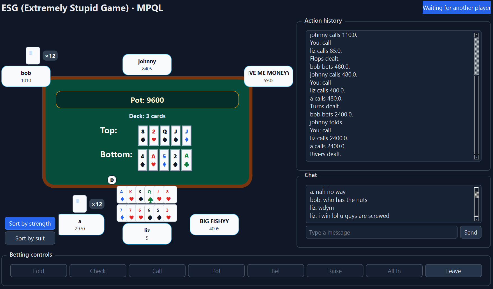
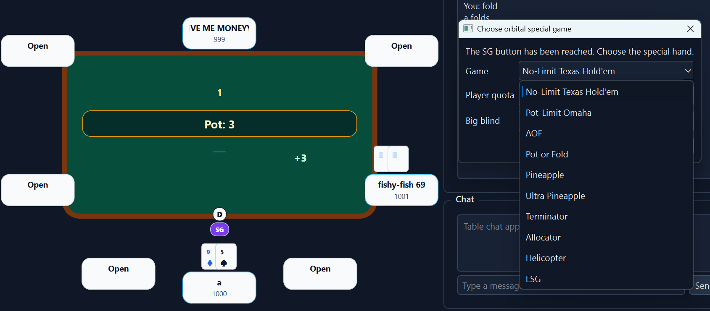
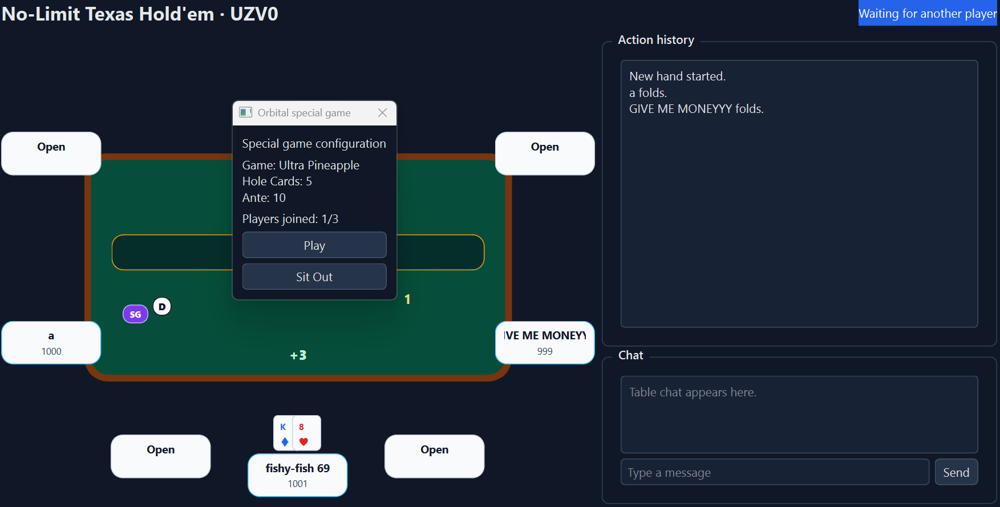
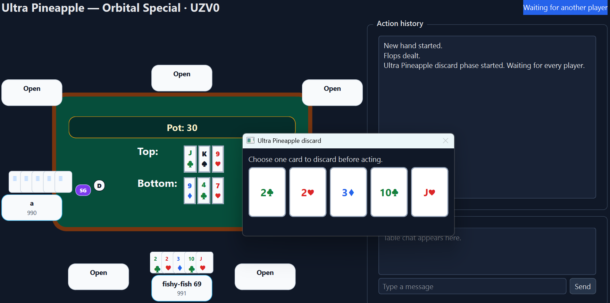
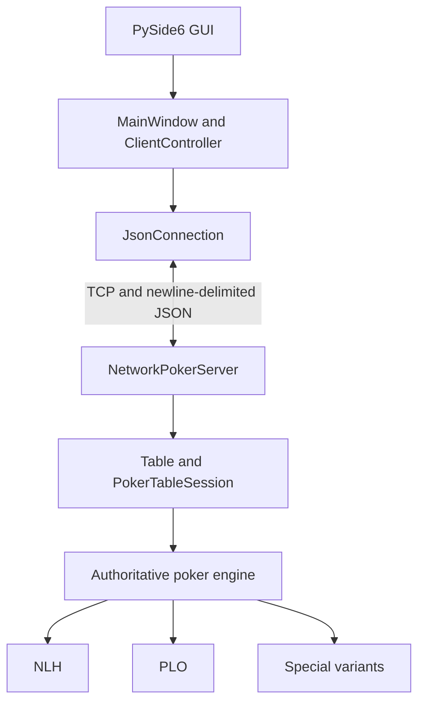

# PokerMeow

**Online private poker with the special games mainstream platforms leave out.**



PokerMeow is a functioning multiplayer desktop poker application built for
private games with unusual variants, large hands, multiple boards, and custom
showdown rules. Its Orbital Special system lets a table temporarily switch to a
different game for selected participants, then return to its normal rotation.

## Why PokerMeow?

Online poker removes much of the manual work of running a game: dealing is
faster, players do not need to gather around one physical table, and software
can track bets and pots. Yet the private games that inspired PokerMeow had one
important reason to keep playing together in person: special games that common
online platforms did not offer.

Those games can involve many private cards, two boards, mandatory discards,
unusual scoring, and side pots across players with different stack sizes. They
are enjoyable to play but cumbersome to operate by hand. PokerMeow grew from a
personal project for recreating that style of session with friends and letting
the software handle its bookkeeping.

The application has since been used for a five-player Internet playtest lasting
hundreds of hands. It remains a personal and portfolio project rather than a
public poker service.

## What Makes It Different?

Most online tables are tied to one game type. PokerMeow can keep an ordinary
Hold'em or Omaha table running while inserting a different variant through
**Orbital Special**:

```text
Normal table rotation
        ↓
Special-game button reaches the dealer
        ↓
Dealer selects a game, configuration, and player quota
        ↓
Other seated players choose Play or Sit Out
        ↓        ↓        ↓
Selected players play one special hand
        ↓
The table restores its normal game and rotation
```

The special hand uses a temporarily selected game engine and configuration
while the surrounding table session, seats, and player stacks persist.

### Selecting a special game

The dealer chooses from the supported variants and configures the fields that
apply to that game.



### Opting in

Other players see the chosen configuration and can play or sit out. If the
quota fills, responses are admitted in receive order.



### Playing the special hand

Only the selected participants enter the special hand. After its showdown, the
session returns to the original table game.



## Features

- Multiplayer play over TCP, including LAN and externally reachable servers
- No-Limit Hold'em, Pot-Limit Omaha, and eight unusual private-game variants
- Orbital Special hands within a persistent table session
- Server-authoritative cards, actions, pots, outcomes, and player-specific state
- Live reconnection snapshots and timed automatic check/fold handling
- Unanimous run-it-twice voting for eligible single-board all-in situations
- Main-pot and side-pot settlement across unequal all-in contributions
- Native single-board, double-board, and alternate-runout presentation
- Responsive PySide6 rendering and local sorting for unusually large hands
- Table chat and per-hand action history
- 157 automated tests run through GitHub Actions

## Special Games

- **No-Limit Texas Hold'em** — standard two-card, single-board Hold'em.
- **Pot-Limit Omaha** — four, five, or six private cards; one or two boards;
  preflop and bomb-pot modes.
- **AOF** — players receive three cards, discard one, then fold or commit a
  fixed ante multiple.
- **Pot or Fold** — four-to-six-card Omaha where the opening choice is pot or
  fold and later players call or fold.
- **Pineapple** — three private cards, one discard, and two Hold'em boards.
- **Ultra Pineapple** — five private cards with one discard on each of the flop,
  turn, and river.
- **Terminator** — six-card pot-limit play where ranks from a terminated board
  remove matching cards from hands and the surviving board.
- **Allocator** — six cards are allocated between two boards and a private-hand
  strength category, producing a combined score.
- **Helicopter** — Allocator with equal private-card draws on the turn and river.
- **ESG (Extremely Stupid Game)** — evolving large private hands, two boards,
  equal street draws, PLO-style board scoring, and a separate private-hand
  strength category.

## Engineering Highlights

### Server-authoritative state

The server owns each table, engine instance, deck, cards, betting state, and
showdown result. Clients submit requested actions; the selected engine validates
them before mutating the game. State is projected separately for each recipient,
so a player receives their own cards while opponents normally receive only the
corresponding hand size and public state.

Relevant code: `server.PokerTableSession`, `network_protocol.visible_state_for`,
and the engines in `nlh.py` and the variant modules.

### Reconnection during a live hand

A dropped connection does not immediately destroy its seat or engine state. A
client that rejoins the same table with the same player name can replace the
disconnected socket and receive the current table, filtered hand state, and
action history. If an absent player is due to act, a server timer eventually
checks when legal or folds, preventing the hand from waiting indefinitely.

This is practical session recovery for trusted private games, not
production-grade identity: reconnects are name-based and the protocol does not
provide account authentication.

### Temporary game-engine substitution

Orbital Special saves the normal table configuration, validates a selected
variant, collects opt-ins concurrently, and runs one hand with the chosen
participants. A `finally` path restores the normal engine configuration and
rotation even when the special-hand path exits unexpectedly.

### Pot and side-pot settlement

The engine tracks both per-street bets and total hand commitments. At showdown,
unique contribution levels form separate pots with distinct eligible-player
pools. Folded players remain contributors but cannot win; tied winners divide
the applicable pot. Allocator and ESG additionally rescore eligible players for
each pot.

### Run it twice and multiple boards

Eligible single-board all-in hands offer a timed vote. Two runs occur only when
every active player agrees. The server preserves the partial board, deals each
completion sequentially, and divides every main and side pot across the
runouts. This is distinct from variants whose normal rules always maintain two
boards.

### Large-hand GUI

Several variants outgrow a conventional two-card layout. `CardFanWidget` wraps
visible cards into rows of six, collapses large hidden hands into a card-back
count, and participates in responsive table geometry. Players with six or more
visible cards can sort their local display by rank strength or suit without
changing authoritative card order.

## Architecture



A player action travels from a Qt control through `MainWindow` and
`ClientController`, then across the TCP/JSON protocol. `PokerTableSession`
passes the request to the current game engine for validation. The server then
sends player-specific updated state, which the controller translates into UI
events for the table view.

The major layers are:

```text
pokermeow_gui/views.py        PySide6 widgets and responsive table rendering
pokermeow_gui/main_window.py  Qt signal binding, dialogs, and UI coordination
pokermeow_gui/controller.py   Presentation-neutral client protocol workflow
pokermeow_gui/networking.py   Client TCP transport and reader thread
network_protocol.py           JSON framing and visible-state projection
server_networking.py          Server-side connection transport
server.py                     Lobby, tables, sessions, and hand orchestration
nlh.py / variant modules      Betting, dealing, evaluation, and game rules
```

Adding a variant is not currently a plug-in operation: depending on its rules,
it may require engine, server orchestration, table-creation UI, and rendering
changes.

## Tech Stack

- Python 3.13
- PySide6 / Qt desktop GUI
- TCP sockets with a newline-delimited JSON protocol
- `Decimal` monetary values
- pytest
- GitHub Actions on Ubuntu

No database, hosted backend, account system, or external poker service is used.

## Testing

The current suite contains **157 passing tests**. It covers engine and variant
rules, legal actions, all-ins and side pots, run-it-twice sequencing, Orbital
Special admission, reconnection snapshots, table/session behavior, controller
protocol handling, and responsive GUI rendering.

GitHub Actions runs the complete suite with Python 3.13 for pushes to `main` and
pull requests targeting `main`:

```powershell
python -m pytest -q
```

The suite is primarily deterministic unit and component testing; it does not
currently include Internet, load, or real-socket end-to-end tests.

## Getting Started

### Requirements

- Python 3.13
- Windows PowerShell for the commands below

### Install from a fresh clone

```powershell
git clone https://github.com/Al-ez/pokermeow
cd pokermeow

py -3.13 -m venv .venv
.\.venv\Scripts\Activate.ps1
python -m pip install --upgrade pip
python -m pip install -r requirements.txt
python -m pytest -q
```

### Start a local game

Start the authoritative server:

```powershell
python server.py
```

In a second activated terminal, start the GUI:

```powershell
python gui.py
```

Use `127.0.0.1` as the server address when the server and client run on the
same computer. Start additional GUI clients in separate terminals to add local
players.

The original CLI network client is also available:

```powershell
python client.py 127.0.0.1
```

### LAN and Internet play

LAN clients connect to the server machine's private IPv4 address. Internet play
requires clients to be able to reach the host's configured TCP port; in the
current self-hosted design that commonly means firewall configuration and
manual router port forwarding. PokerMeow does not currently provide hosted
servers, encrypted transport, authentication, or automatic NAT traversal.

### Windows executable bundle

To build the existing PyInstaller bundle:

```powershell
.\build_windows.ps1
```

The output is written under `dist\` and contains `PokerMeow.exe`,
`PokerMeowServer.exe`, and the Windows quick-start guide.

## Project Status

PokerMeow is a personal project intended for private play with friends and as a
software engineering portfolio project. It has been exercised in a five-player
Internet session over hundreds of hands, but it is not positioned as a hosted,
production-scale, or public poker service.

Possible future directions include hosted server infrastructure, authenticated
identity, smoother application updates, more variants, ledger/session tools,
and web or mobile clients.

## License

Copyright is retained by the author. This source is publicly visible solely for
portfolio and evaluation purposes. No permission is granted to copy, modify,
distribute, sublicense, or use the source code or software without the author's
explicit permission. All rights reserved.
